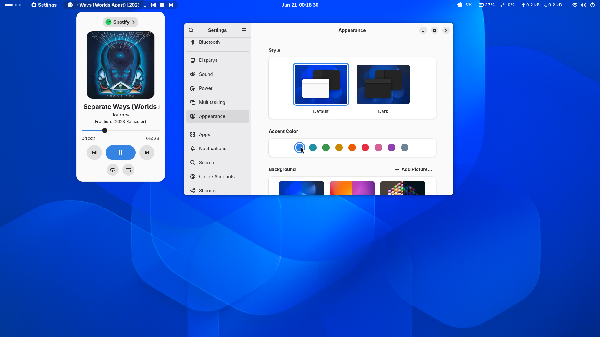
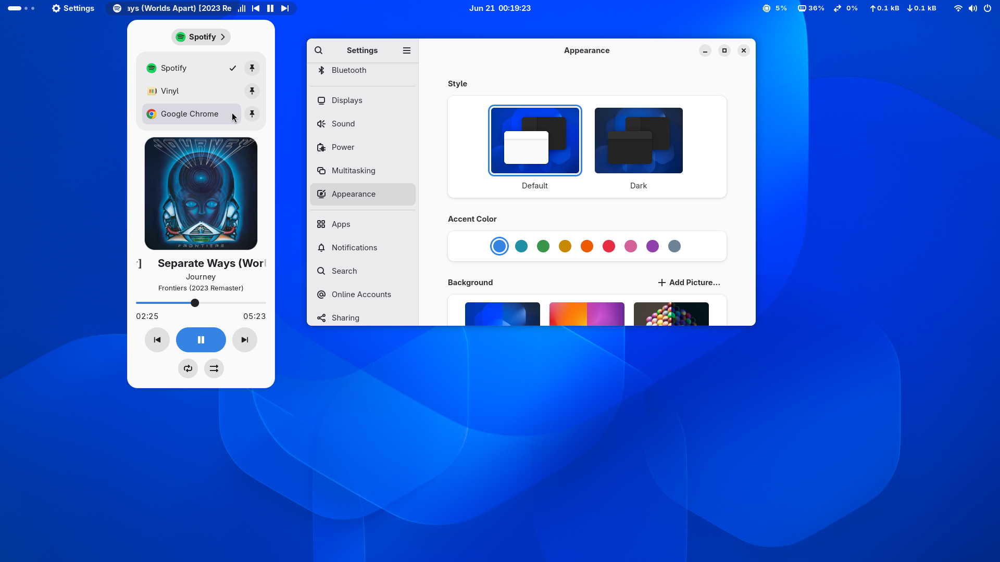
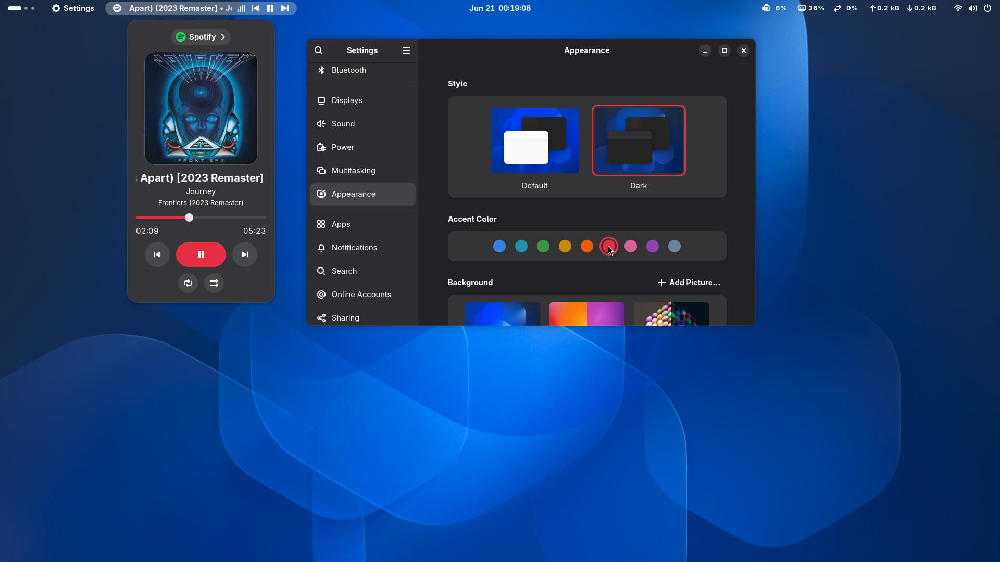
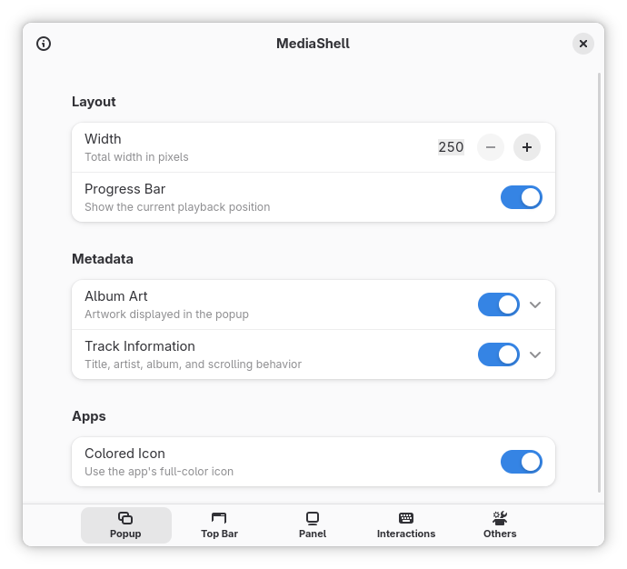
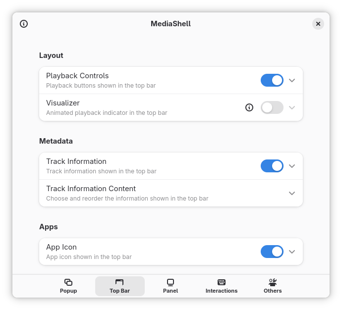
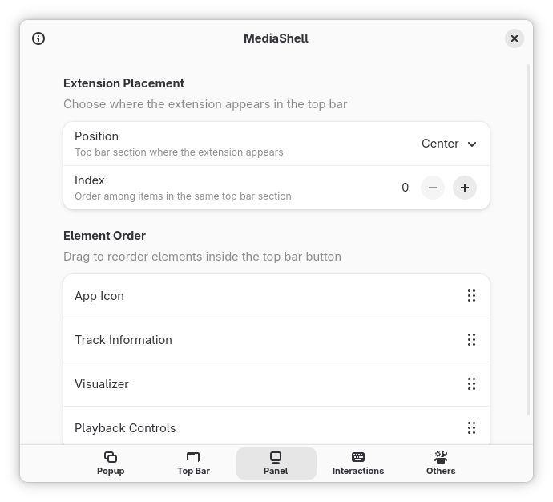
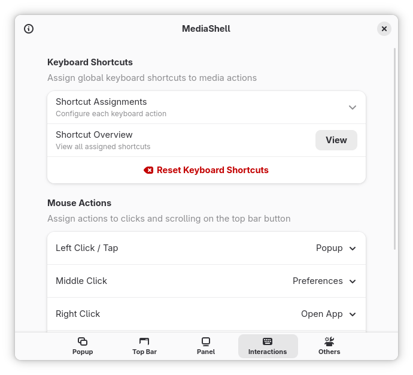
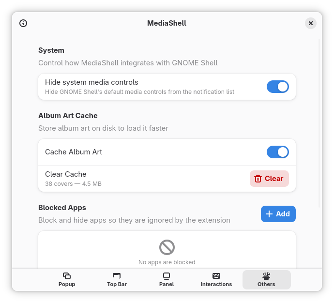
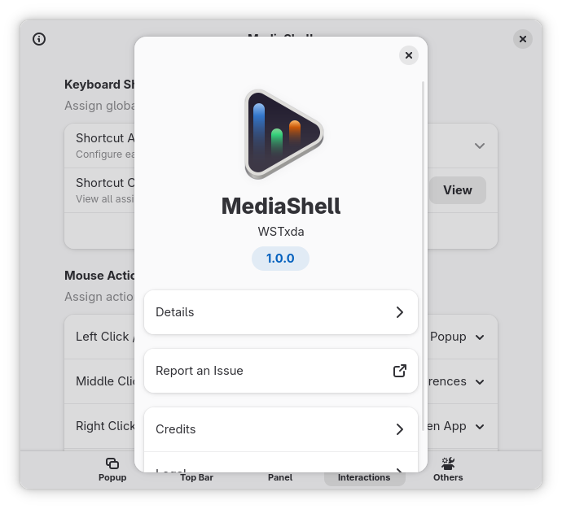

# MediaShell – GNOME Shell Media Controls

A GNOME Shell extension that adds configurable MPRIS media controls to the top bar.

[](https://www.kernel.org)
[](https://www.gnome.org)
[](https://github.com/WSTxda/MediaShell/releases/latest)
[](https://github.com/WSTxda/MediaShell/releases)


MediaShell is a GNOME Shell extension that adds media controls to your top bar. Click the icon to open a popup featuring album art, playback controls, and an app selector for any app currently playing media. The top bar widget and popup use the GNOME Shell UI toolkit, and preferences are built with GTK4 and Libadwaita to match the rest of the desktop.

<details>
  <summary><h3>Screenshots</h3></summary>

### Workspace

<table>
  <tr>
    <td align="center"><strong>Popup</strong></td>
    <td align="center"><strong>Popup app selector</strong></td>
    <td align="center"><strong>Popup theming</strong></td>
  </tr>
  <tr>
    <td></td>
    <td></td>
    <td></td>
  </tr>
</table>

### Extension settings

<table>
  <tr>
    <td align="center"><strong>Popup</strong></td>
    <td align="center"><strong>Top Bar</strong></td>
    <td align="center"><strong>Panel</strong></td>
  </tr>
  <tr>
    <td></td>
    <td></td>
    <td></td>
  </tr>
</table>

<table>
  <tr>
    <td align="center"><strong>Interactions</strong></td>
    <td align="center"><strong>Others</strong></td>
    <td align="center"><strong>About</strong></td>
  </tr>
  <tr>
    <td></td>
    <td></td>
    <td></td>
  </tr>
</table>

</details>

## Features

#### Fits into GNOME

* The top bar and popup use the GNOME Shell UI toolkit and follow the same design as Quick Settings.
* Preferences are built with GTK4 and Libadwaita, adhering to the GNOME Human Interface Guidelines.

#### App selector

* The App selector in the Popup switches between any active media app.
* The pin feature keeps a media app selected while it is playing, but this selection does not save across shell restarts.
* You can raise or quit an app's window if its MPRIS implementation supports it.
* Block apps that you don't want MediaShell to detect, without affecting their MPRIS service.

#### Album art

* Supports local and remote artwork with a configurable corner radius.
* Optional disk cache for faster loads, adjustable from settings.

#### Mouse and keyboard

* Left, middle, and right click actions as well as scroll actions on the Top Bar button.
* Global keyboard shortcuts for playback, volume, app selection, raising or quitting, opening the Popup, and accessing settings.

#### Layout

* Choose where the button is placed in the Top Bar.
* Configure Track Information, Playback Controls, and the optional Top Bar Visualizer in a stable element order.
* Hide the built-in GNOME Shell media controls from the notification list and use MediaShell instead.

## Requirements

* **GNOME Shell** 47–50
* An **MPRIS** compatible media app or browser playback source like Spotify, VLC, Firefox, Vinyl, etc.

> [!IMPORTANT]
> Available controls depend on the features provided by each media app through MPRIS. Seeking, shuffle, repeat, volume, artwork, and application actions may not be supported by every app.

> [!NOTE]
> Browsers decide how each website appears to GNOME. MediaShell follows what the browser reports, so web players can appear, change, or disappear when you switch tabs, navigate pages, or move playback between websites.

## Download

[](https://github.com/WSTxda/MediaShell/releases/latest)
[](https://t.me/WSTprojects)

## Manual installation

1. Download the latest extension package from [releases](https://github.com/WSTxda/MediaShell/releases/latest).
2. Install it using GNOME Extensions or the command line:

```bash
gnome-extensions install --force mediashell@wstxda.github.com.shell-extension.zip
gnome-extensions enable mediashell@wstxda.github.com
```

3. Log out and back in to activate the extension. On X11 you can restart GNOME Shell in place with `Alt+F2`, type `r`, and press Enter.

## Development

Use the Node.js and pnpm versions listed in `package.json`, along with GJS, GNU gettext, GLib development tools, GNOME Shell, and `gnome-extensions`. Release verification also expects `shexli` in `PATH`.

```bash
pnpm install
pnpm doctor
pnpm check
pnpm build
pnpm verify
```

The generated extension package is saved to `dist/builds/`. `pnpm build` validates source and package contents; `pnpm verify` runs the full release-oriented path, including `shexli` against the generated archive.

From the repository root, inspect or install the generated package with the full path:

```bash
pnpm run check:package
pnpm run check:shexli
gnome-extensions install --force dist/builds/mediashell@wstxda.github.com.shell-extension.zip
```

### Documentation

* [Contributing](CONTRIBUTING.md)
* [Architecture](docs/ARCHITECTURE.md)
* [Development](docs/DEVELOPMENT.md)

### Donate

[](https://www.paypal.com/donate/?cmd=_donations&business=wstxda@gmail.com&currency_code=USD)
[](https://www.buymeacoffee.com/wstxda)

### Credits

**[Sakith B.](https://github.com/sakithb)**<br>
For your work on the [Media Controls](https://github.com/sakithb/media-controls) extension.
