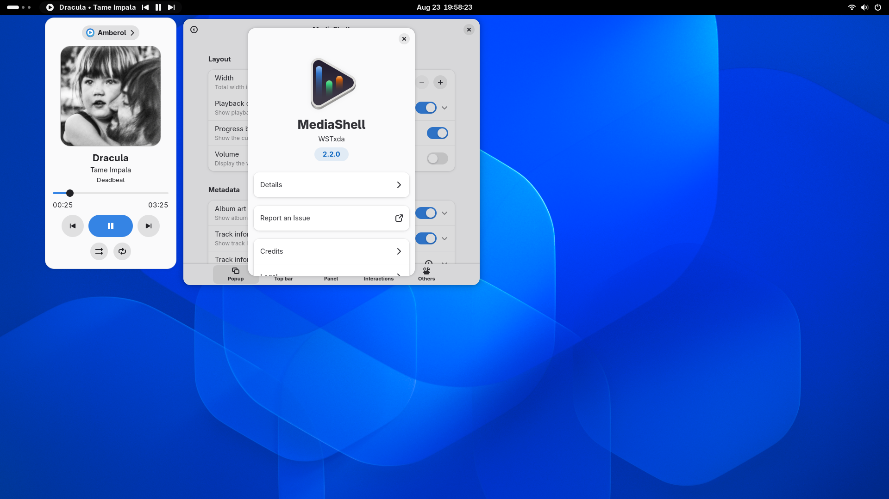
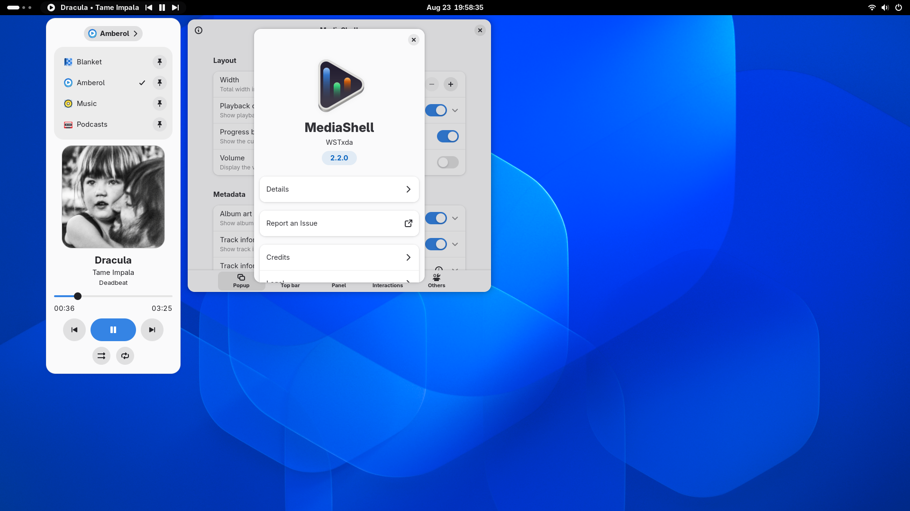
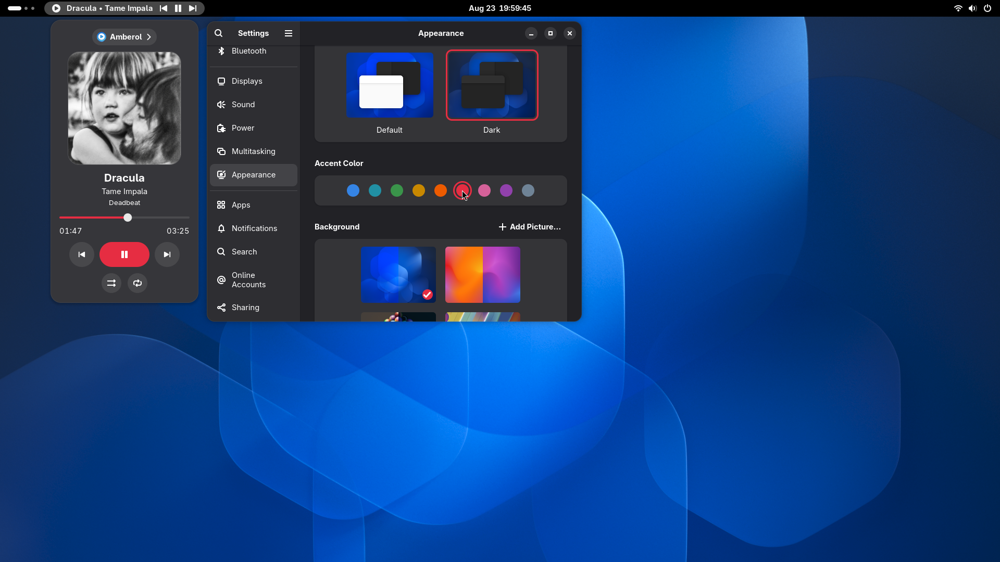
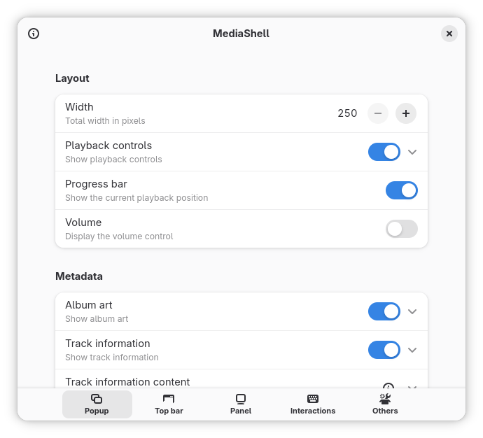
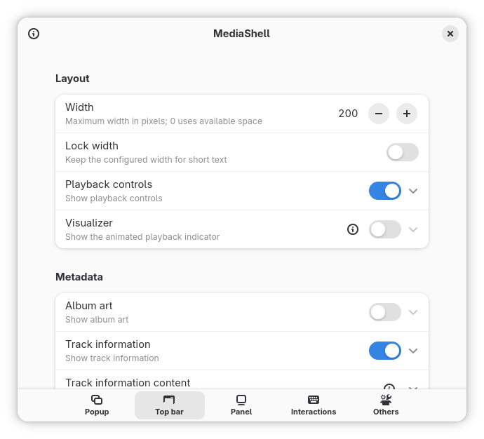
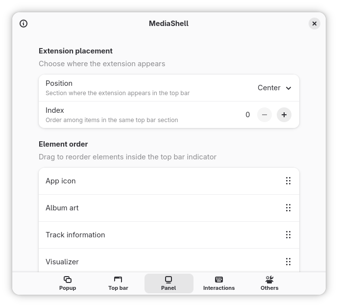
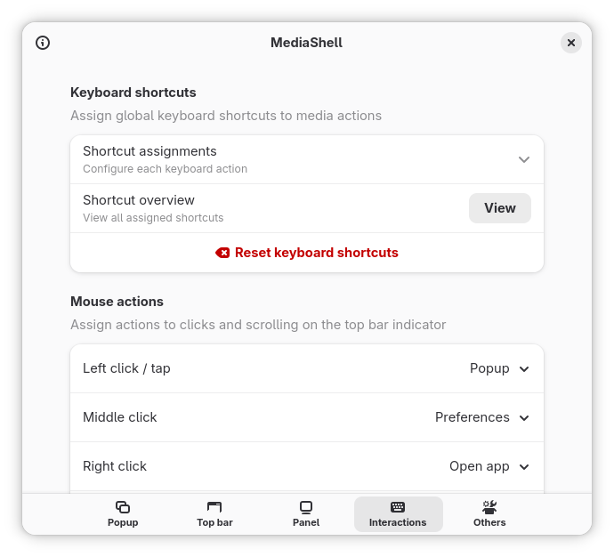
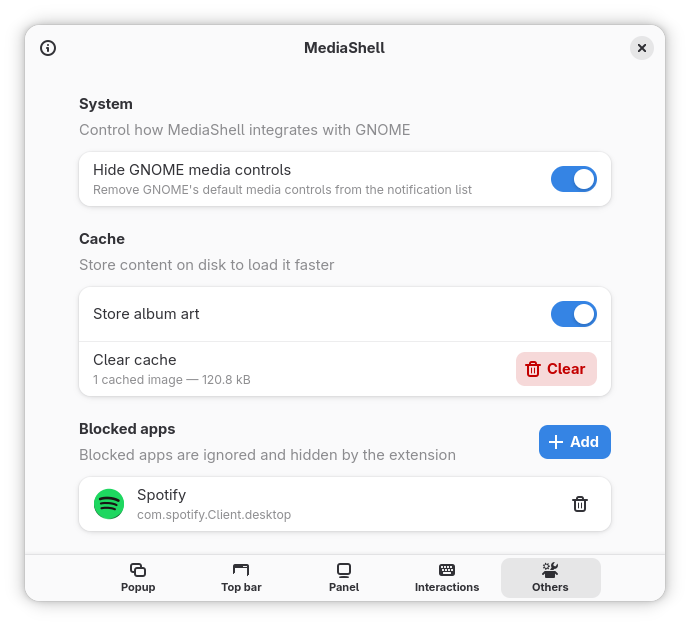
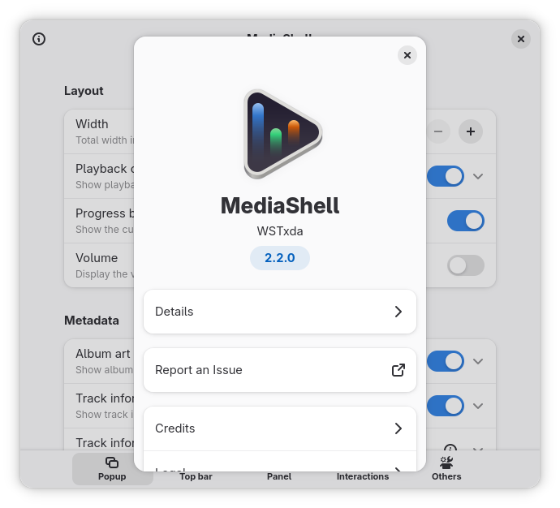

# MediaShell – GNOME Media Controls

A GNOME extension that adds configurable MPRIS media controls to the top bar.

[](https://www.kernel.org)
[](https://www.gnome.org)
[](https://github.com/WSTxda/MediaShell/releases/latest)
[](https://github.com/WSTxda/MediaShell/releases)


MediaShell is a GNOME Shell extension that adds configurable MPRIS media controls to the top bar. Its customizable popup displays album art, track information, playback controls, and a selector for switching between active media apps. The top bar and popup can be configured independently, while GTK4 and Libadwaita preferences provide a consistent GNOME experience.

<details>
  <summary><h3>Screenshots</h3></summary>

### Workspace

<table>
  <tr>
    <td align="center"><strong>Popup</strong></td>
    <td align="center"><strong>Popup media app selector</strong></td>
    <td align="center"><strong>Popup theming</strong></td>
  </tr>
  <tr>
    <td></td>
    <td></td>
    <td></td>
  </tr>
</table>

### Extension settings

<table>
  <tr>
    <td align="center"><strong>Popup</strong></td>
    <td align="center"><strong>Top bar</strong></td>
    <td align="center"><strong>Panel</strong></td>
  </tr>
  <tr>
    <td></td>
    <td></td>
    <td></td>
  </tr>
</table>

<table>
  <tr>
    <td align="center"><strong>Interactions</strong></td>
    <td align="center"><strong>Others</strong></td>
    <td align="center"><strong>About</strong></td>
  </tr>
  <tr>
    <td></td>
    <td></td>
    <td></td>
  </tr>
</table>

</details>

## Features

#### Fits into GNOME

- The top bar and popup use GNOME Shell widgets and follow the desktop's visual language.
- Preferences are built with GTK4 and Libadwaita.

#### Playback controls

- Configure the popup and top bar independently.
- Available controls include previous, play/pause, next, seek, shuffle, repeat, and popup playback speed.
- Controls react to the capabilities reported by the active media app.

#### Media app selector

- Switch between media apps currently available through MPRIS.
- Pin the selected media app for the current Shell session.
- Open or quit an app when its MPRIS implementation supports the action.
- Block apps you do not want MediaShell to display without changing their MPRIS service.

#### Album art

- Supports local and remote album art with configurable presentation.
- An optional persistent cache improves repeated loads and can be inspected or cleared from Preferences.

#### Mouse and keyboard

- Configure left, middle, and right click actions, scroll actions, and touch behavior on the top bar indicator.
- Use global shortcuts for playback, volume, media app switching, opening the popup, and Preferences.

#### Layout

- Choose the panel position and the order of top bar elements.
- Configure track information, playback controls, the app icon, and the optional visualizer.
- Enabling popup seek controls raises the configured popup width to the minimum needed to keep the controls full-sized.
- Optionally hide GNOME's built-in media controls while MediaShell is enabled.

## Requirements

- **GNOME Shell** 47–51
- An **MPRIS-compatible** media app or browser media session

> [!IMPORTANT]
> Available controls depend on the capabilities reported by each MPRIS implementation. Seeking, speed, shuffle, repeat, volume, album art, and media-app actions may not be supported by every media app or track.

> [!NOTE]
> Browsers decide how websites are exposed through MPRIS. A browser session may change identity or disappear when tabs, pages, or playback ownership change.

## Download

[](https://github.com/WSTxda/MediaShell/releases/latest)
[](https://t.me/WSTprojects)

## Manual installation

1. Download the latest extension package from [releases](https://github.com/WSTxda/MediaShell/releases/latest).
2. Install it using GNOME Extensions or the command line:

```bash
gnome-extensions install --force mediashell@wstxda.github.com.shell-extension.zip
gnome-extensions enable mediashell@wstxda.github.com
```

3. Log out and back in after the first installation. On X11, GNOME Shell can instead be restarted with `Alt+F2`, `r`, and Enter.

## Development

Use the Node.js and pnpm versions declared in `package.json`. GNOME development also requires GJS, GNU gettext, GLib tools, GNOME Shell, and `gnome-extensions`; release verification uses `shexli`.

```bash
pnpm install
pnpm run env:doctor
pnpm check
pnpm build
pnpm verify
```

The generated extension package is written to `dist/builds/`.

### Documentation

- [Contributing](CONTRIBUTING.md)
- [Architecture](docs/ARCHITECTURE.md)
- [Development](docs/DEVELOPMENT.md)

### Donate

[](https://www.paypal.com/donate/?cmd=_donations&business=wstxda@gmail.com&currency_code=USD)
[](https://www.buymeacoffee.com/wstxda)

### Credits

**[Sakith B.](https://github.com/sakithb)**<br>
For your work on the [Media Controls](https://github.com/sakithb/media-controls) extension.
